# 🚀 Validatus - AI-Powered Strategic Analysis Platform

A cloud-native, AI-first architecture on Google Cloud Platform for comprehensive three-stage analytical workflows.

[](https://github.com/ArjunSeeramsetty/Validatus2/blob/main/LICENSE)
[](https://www.python.org/downloads/)
[](https://cloud.google.com/)
[](https://fastapi.tiangolo.com/)

> **Status**: Phase 2 Complete ✅ - Advanced strategic analysis engine with expert persona scoring, content quality analysis, and performance optimization ready for production deployment.

## 🎯 Overview

Validatus is an enterprise-grade platform that enables strategic analysis through three distinct stages:

1. **Knowledge Acquisition & Vector Store Creation** - Intelligent content collection and processing
2. **Strategic Analysis Execution** - AI-powered scoring and factor analysis  
3. **Results Dashboard & Visualization** - Interactive insights and reporting

## 🚀 Key Features

### Phase 1 ✅ (Completed)
- **GCP-Native Architecture** - Built on Google Cloud Platform with enterprise scalability
- **Topic-Based Knowledge Management** - Organized vector stores for different analysis topics
- **URL Orchestration** - Intelligent content collection and validation
- **Real-Time Processing** - Cloud Tasks and Pub/Sub for scalable job processing

### Phase 2 ✅ (Completed)
- **Enhanced Knowledge Acquisition** - Content quality analysis and classification
- **Strategic Analysis Engine** - Expert persona scoring across 10 business layers
- **Advanced Content Processing** - Deduplication and semantic clustering
- **Formula Calculation Engine** - Mathematical modeling of strategic factors
- **Performance Optimization** - Multi-level caching and parallel processing
- **Analysis Session Management** - Complete workflow orchestration

### Enterprise Features
- **AI-Powered Analysis** - Leverages Vertex AI and advanced ML models
- **Enterprise Security** - IAM, VPC, and comprehensive audit logging
- **Real-Time Monitoring** - Progress tracking and performance metrics

## 🚀 Phase 2 Implementation Overview

### Implementation Timeline (8 Weeks)

#### **Weeks 5-6: Enhanced Knowledge Acquisition** ✅
- **Content Quality Analyzer** - Multi-metric content assessment (8 quality dimensions)
- **Topic Classification Service** - Advanced classification with semantic clustering
- **Content Deduplication Service** - Multi-level deduplication with similarity algorithms
- **Enhanced Topic Vector Store Manager** - ML-powered content processing

#### **Weeks 7-8: Advanced Content Processing** ✅
- **Intelligent Content Processing** - Quality filtering and classification
- **Semantic Clustering** - K-means clustering with TF-IDF vectorization
- **Performance Optimization** - Chunked processing and memory management
- **Vector Store Optimization** - Enhanced embedding generation and storage

#### **Weeks 9-10: Strategic Analysis Engine** ✅
- **Expert Persona Scorer** - 10 specialized expert personas for business analysis
- **Formula Calculation Engine** - Mathematical modeling of strategic factors
- **Analysis Session Manager** - Complete workflow orchestration
- **Parallel Processing** - Scalable analysis execution

#### **Weeks 11-12: Analysis Optimization** ✅
- **Multi-level Caching** - Memory, distributed, and persistent caching
- **Error Recovery** - Exponential backoff and intelligent retry mechanisms
- **Resource Optimization** - Dynamic concurrency and memory management
- **Performance Monitoring** - Comprehensive metrics and analytics

### Core Components Implemented

| Component | Description | Status |
|-----------|-------------|--------|
| **Content Quality Analyzer** | 8-metric quality assessment system | ✅ Complete |
| **Topic Classification Service** | ML-powered content categorization | ✅ Complete |
| **Content Deduplication Service** | 4-level similarity detection | ✅ Complete |
| **Expert Persona Scorer** | 10 business expert personas | ✅ Complete |
| **Formula Calculation Engine** | Strategic factor mathematics | ✅ Complete |
| **Analysis Session Manager** | Workflow orchestration | ✅ Complete |
| **Optimization Service** | Performance and caching | ✅ Complete |
| **Enhanced Vector Store Manager** | ML-powered topic management | ✅ Complete |

### Strategic Analysis Workflow

```mermaid
graph LR
    A[üìù Session Creation] --> B[üìö Knowledge Acquisition]
    B --> C[üîç Content Quality Analysis]
    C --> D[🏷️ Topic Classification]
    D --> E[üßπ Content Deduplication]
    E --> F[🧠 Expert Layer Scoring]
    F --> G[üìä Factor Calculation]
    G --> H[🎯 Segment Analysis]
    H --> I[üìà Results Compilation]
    I --> J[üìã Insights Generation]
    
    style A fill:#E3F2FD
    style B fill:#E8F5E8
    style C fill:#FFF3E0
    style D fill:#F3E5F5
    style E fill:#FFEBEE
    style F fill:#E3F2FD
    style G fill:#E8F5E8
    style H fill:#FFF3E0
    style I fill:#F3E5F5
    style J fill:#FFEBEE
```



## 🏗️ Architecture

### High-Level Architecture


### Phase 2 Implementation Architecture


### Comprehensive Phase 2 System Architecture


### Technology Stack

**Backend:**
- FastAPI with async/await support
- Google Cloud Platform services
- Vertex AI for embeddings and ML
- Cloud SQL (PostgreSQL) for structured data
- Firestore for document storage
- Cloud Storage for file management

**Infrastructure:**
- Terraform for Infrastructure as Code
- Cloud Run for containerized services
- Cloud Tasks for job queuing
- Pub/Sub for event-driven architecture

## 📋 Prerequisites

- Google Cloud Platform account with billing enabled
- Python 3.11+
- Docker (for containerization)
- Terraform (for infrastructure deployment)

## 🛠️ Setup Instructions

### 1. Clone the Repository

```bash
git clone https://github.com/ArjunSeeramsetty/Validatus2.git
cd Validatus2
```

### 2. Configure Environment Variables

```bash
cp .env.example .env
# Edit .env with your GCP project details
```

### 3. Set Up GCP Infrastructure

```bash
cd infrastructure/terraform
terraform init
terraform plan -var="project_id=your-project-id"
terraform apply -var="project_id=your-project-id"
```

### 4. Deploy Backend Services

```bash
cd backend
pip install -r requirements-gcp.txt
python -m app.main
```

### 5. Run with Docker (Recommended)

```bash
# Build and run with GCP integration
docker build -f backend/Dockerfile.gcp -t validatus-backend .
docker run -p 8000:8000 --env-file .env validatus-backend
```

## 🔧 Configuration

### Environment Variables

Key configuration options in `.env`:

- `GCP_PROJECT_ID` - Your Google Cloud Project ID
- `CLOUD_SQL_INSTANCE` - Cloud SQL instance name
- `VERTEX_AI_LOCATION` - Vertex AI region
- `ALLOWED_ORIGINS` - CORS allowed origins

### GCP Services Required

The platform uses the following GCP services:
- Cloud Run (compute)
- Cloud SQL (database)
- Cloud Storage (file storage)
- Vertex AI (AI/ML)
- Cloud Tasks (job processing)
- Pub/Sub (messaging)
- Cloud Monitoring (observability)

## 📊 API Endpoints

### Phase 1 - Basic Topic Management
- `GET /api/v3/topics` - List all available topics
- `POST /api/v3/topics/create` - Create new topic vector store
- `POST /api/v3/topics/{topic}/collect-urls` - Collect URLs for topic
- `GET /api/v3/topics/{topic}/evidence/{layer}` - Retrieve evidence by layer

### Phase 2 - Enhanced Features

#### Enhanced Topic Management
- `POST /api/v3/enhanced/topics/create` - Create enhanced topic store with quality analysis
- `GET /api/v3/enhanced/topics/{topic}/knowledge` - Get comprehensive topic knowledge
- `PUT /api/v3/enhanced/topics/{topic}/update` - Update topic store with new content
- `GET /api/v3/enhanced/topics/{topic}/performance` - Analyze topic performance

#### Strategic Analysis
- `POST /api/v3/analysis/sessions/create` - Create analysis session
- `POST /api/v3/analysis/sessions/{session_id}/execute` - Execute strategic analysis
- `GET /api/v3/analysis/sessions/{session_id}/status` - Get session status
- `GET /api/v3/analysis/sessions/{session_id}/results` - Get analysis results

#### Content Processing
- `POST /api/v3/content/analyze-quality` - Analyze content quality
- `POST /api/v3/content/deduplicate` - Deduplicate content
- `POST /api/v3/optimization/parallel-processing` - Optimize parallel processing

### Health & Monitoring
- `GET /health` - Health check endpoint

## ☁️ Google Cloud Platform Integration

### Core Infrastructure Services
- **Cloud Run** - Microservices hosting and auto-scaling
- **Vertex AI** - ML/AI services and model hosting
- **Cloud SQL** - PostgreSQL relational database
- **Firestore** - NoSQL document database
- **Cloud Storage** - Scalable file and object storage
- **Cloud Tasks** - Asynchronous job processing
- **Pub/Sub** - Event-driven messaging and streaming
- **Cloud Functions** - Serverless compute for lightweight tasks

### AI/ML Services
- **Vertex AI Embeddings** - Text embedding generation (`text-embedding-004`)
- **Vertex AI Model Garden** - Access to pre-trained models
- **Vertex AI Vector Search** - Semantic search and similarity matching
- **Vertex AI Workbench** - ML development environment
- **Gemini 1.5 Pro** - Large language model for expert analysis

### Monitoring & Observability
- **Cloud Monitoring** - Custom metrics and dashboards
- **Cloud Logging** - Centralized log aggregation
- **Cloud Trace** - Distributed request tracing
- **Error Reporting** - Automatic error detection and alerting
- **Cloud Profiler** - Performance profiling and optimization

### Security & Compliance
- **Cloud IAM** - Identity and access management
- **VPC Security** - Network isolation and firewall rules
- **Secret Manager** - Secure credential and key storage
- **Cloud Audit Logs** - Comprehensive audit trail
- **Cloud Armor** - DDoS protection and WAF capabilities

## 🧪 Testing

```bash
cd backend
pip install -r requirements.txt
pytest tests/ -v
```

## 📈 Monitoring

The platform includes comprehensive monitoring:

- **Cloud Monitoring** - Custom metrics and dashboards
- **Cloud Logging** - Centralized log aggregation
- **Error Reporting** - Automatic error tracking
- **Performance Monitoring** - Request tracing

## 🔒 Security

- **IAM Integration** - Role-based access control
- **VPC Security** - Network isolation
- **Secret Manager** - Secure credential storage
- **Audit Logging** - Complete audit trail

## 🚀 Deployment

### Development

```bash
# Local development with hot reload
uvicorn app.main:app --reload --host 0.0.0.0 --port 8000
```

### Production

```bash
# Deploy to Cloud Run
gcloud run deploy validatus-backend \
  --image gcr.io/your-project/validatus-backend:latest \
  --region us-central1 \
  --platform managed
```

## 📚 Documentation

- [Architecture Overview](docs/architecture/)
- [API Documentation](docs/api/)
- [Deployment Guide](docs/deployment/)

## 🤝 Contributing

1. Fork the repository
2. Create a feature branch
3. Make your changes
4. Add tests
5. Submit a pull request

## 📄 License

This project is licensed under the MIT License - see the [LICENSE](LICENSE) file for details.

## 🆘 Support

For support and questions:
- Create an issue in the GitHub repository
- Check the documentation in the `docs/` folder
- Review the architecture plan in `VALIDATUS_IMPLEMENTATION_PLAN.md`

---

**Built with ❤️ for enterprise-scale AI-powered strategic analysis**
